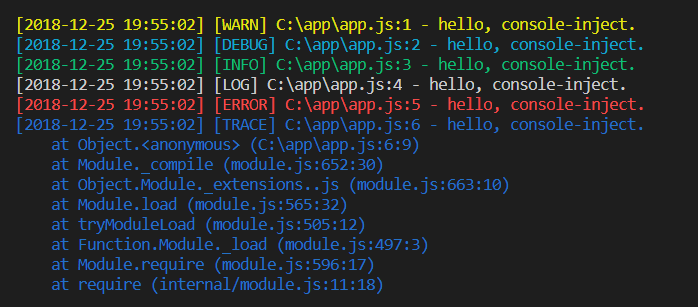

# console-inject
Node.js console logging with color, timestamp, filename and line number.

[](https://www.npmjs.com/package/console-inject)

## Preview


## Installing
```
npm install console-inject
```

## Usage
In consideration of the `console` usage, console-inject overrides `console.log`, `console.info`, `console.warn`, `console.trace`, `console.debug`, `console.error`. So, it's ok that you just require "console-inject" to inject before the main program entry point.     

```javascript
require('console-inject');
```

Of course, you can also inject by command, console-inject supports various Node.js application starters such as `node`, `nodemon`, etc. In that way, you can enjoy the console-inject features without changing the program.

```
console-inject node app.js
```
